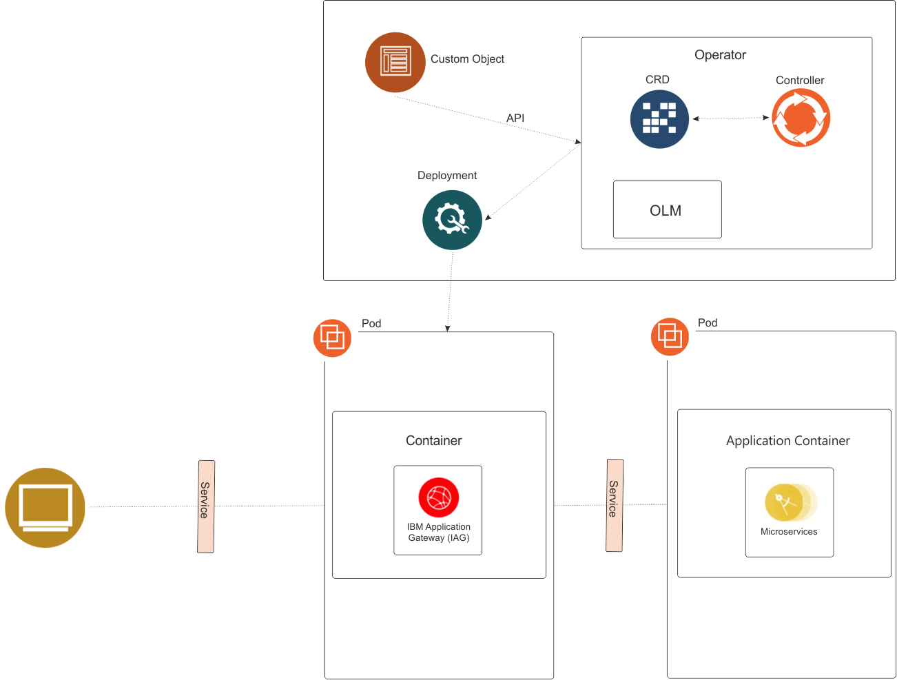
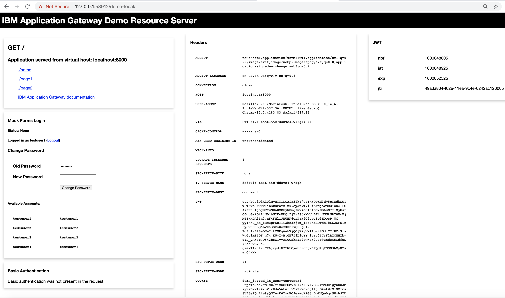

# Introduction
The custom resource deployment model involves creating an IBM Application Gateway custom resource. The IBM Application Gateway operator will handle the creation and lifecycle management of the IBM Application Gateway instance. 



The example described in this document shows how custom resources can be used to protect an application using IBM Application Gateway.

> Note: It is assumed that the IBM Application Gateway operator has already been installed into the environment and is available.

# Steps

The following steps will:

* Create an instance of the IBM Application Gateway using a custom resource
* Access a protected application via the IBM Application Gateway
	* The page will show the identity and other headers that have been added to the request by the IBM Application Gateway

> This example does not include authentication. This example illustrates the deployment process for using IBM Application Gateway as a proxy to a protected application. 

1. Paste the following into a file named iag\_service\_account.yaml.

```yaml
apiVersion: v1
kind: ServiceAccount
metadata:
  name: ibm-application-gateway
```

2. Create the service account.

```shell
kubectl create -f iag_service_account.yaml
```

3. Paste the following into a file named co.yaml.

```yaml
apiVersion: ibm.com/v1
kind: IBMApplicationGateway
metadata:
  name: iag-instance
spec:
  replicas: 1
  deployment:
    serviceAccountName: ibm-application-gateway
    image: icr.io/ibmappgateway/ibm-application-gateway:22.07.0
    imagePullPolicy: IfNotPresent 
  configuration:
    - type: literal 
      value: |
        version: "22.07"
        resource_servers:
          - path: "/static"
            connection_type: "ssl"
            servers:
              - host: resource-server.au-syd.mybluemix.net
                port: 443
            identity_headers:
              attributes:
                - attribute: groupIds
                  header: iv_groups
                - attribute: AZN_CRED_AUTHZN_ID
                  header: iv_user
              jwt:
                certificate: "B64:QmFnIEF0dHJpYnV0ZXMKICAgIGZyaWVuZGx5TmFtZTogUlNBCiAgICBsb2NhbEtleUlEOiAwMyA4MiAwMSAwMSAwMCBEMyAwMyBCNSBFMiBERSA3RiBEMSAwOCBFOCBBMCA5QyBENCBDRSBCOCAwQSA1QSBEOSAyRCA2NSAzMCBDNyA3MCA5RiAyRCAxRiA0OSBFRSA3MCA1OCA3QyAyRSA0MCBDOCA3MCBGRSBEOSBFNiAzRSA0RSA2QiBENiAzOCBFMCBEMiAyMyAzOCA3QyBGOSA2RCBDMiAxNCAyRSBERCA2NyBGMSBBRCBDOCAwMyAxNCAyQiBGNCAzNCBEOCA4MCA4MSAwNCBFMiBFMCBBRCA2MSBDMCA4NyA2MSA2RiBCQiA5RSAzMiBDNSBEMCA0MiBERSAxMCBEQSAwNCBDNSAzRSA5OCA2QSA2NCBCQiBCNyA2RSBDQiBDRSBGQyBFRCBDMCBEQiBFMyA3RiAzQSBFRCAxQSBBMyBCNSBBMyBDNyBDRCAxMyAwMSA1NCAwMCBGMSBGRCAwNyBCRCA1NSA3QiBCMyA0NCBFMiA4RiA1OSA0RSAyNSBENiBFMSAyQiBFRSA3MSBFOCBGMCA2NSAxNiAxOCA2OCBEQiBCNCBCNiBBMCBDMiAxNiAwMCBBMiA4MSA1RiBGNyA2NCAwNiA1RiBEQSAyQSBENiA3MiBFRiBCMyBBQyBBMyA0NyAyMiBFOCAxRCA2NiAxMSBDOCBBNSBDOCBBNyAxRCBFNiAxMSA4QiAwOSBBQyAzMyAzNSBGQyAzMyBEOSA5RiA1OCBDNSAzOSBFNyBDMyA3MCAwMiA4NCAxQSA2MSAyMSA5MSBDNCBCOSA2MSBEMiAzOSA3NiBFMSAzRiAzQSBGOCBFNCBGRSBBRSAyQiBCNiA1MyAxMSA0NCBDNiAxRCA2RiA1RCBGMyBGQyAxMyAyNCBFNCA2RCA4QiAwRSA0NCAyNiAzMCAxQSA1QSAyOSA2RSA5RiA4MiBGRCBFRSA2QyA2QSBCQyBBOCBCRiAyQyBCMSA3MiBBQiBENSBDMCBGNyA3NCA3MiA5NCA4RSA3RSA5QyAxOSBFNyAyRiA1MCBEMSAKS2V5IEF0dHJpYnV0ZXM6IDxObyBBdHRyaWJ1dGVzPgotLS0tLUJFR0lOIFBSSVZBVEUgS0VZLS0tLS0KTUlJRXZ3SUJBREFOQmdrcWhraUc5dzBCQVFFRkFBU0NCS2t3Z2dTbEFnRUFBb0lCQVFEbllIR3ZsY0VsWE1jVQprNWVxZ3d2ajJNc2FQblVPWVJYdy9FY2dzRWhKdnRtUVg4ak5lR3Fia1ZnSEJWL3RwZ1lsOW1jSHRPeXRvTzdRCjRLczhBZUFYek5tVCttUTNOR1h5bmx3K1Jod1prZm5vWUhZUExldkZhby82YzY5M1Z6WFFqaXpWa1RITHNjZloKeXJNN2VYdU9rcU9kUlVDTnpFSmNyVVlna3MrTVhsRlo0Zjk0WU9vZGNzYkJzLzZRYXFiWXBVcEEwUXpvRDRRaQpxOXlmUEFoM002WUJ5SnNMeGw5Q3RrVnlSaVFKUG5vZGl1SW1DNTRmZTBIN0NHNlpFOUhCeEc0YTBaZ1VVYWM2CnZoU25zaDJvRVVvQnZkaXVxaWsrYU1uNzFVR3BFTDRZWjQ2STRsQWd4d2xLRlBOZE5zSzBJY0VZbUo4VndCUUQKVnZsQlpKSVRBZ01CQUFFQ2dnRUFaOG4xZFVRQjdoYWVIdmJOOCtqdzduWVROV1NLOGJaUE4xaVROM0NjSEtpRgp3Nk9UMmNlSVd0eHAxa3hzNlpldDdsMkhmZ2VFbTZZek9uTnRuRzlpN0lveGw1V2NXcjhnZENMaFVmWDFLT3M0ClpTclFDcU1ZdmVlOVNpV1dzanZtb2ZVRTI1QlQvQUYxbXBhNHE1Y2srNkYvejA1L1ZKd3BzSlR4Zmk4Yzl1T0YKdGVxMmJDMUJUdFhNSjhJaHZTNi9LWjk0SFZzT2NwcHg2bG5oR1lwS0pQbHU2UHRZYmxCNjFYNkZqWng2MkloRgpQU0Z0UXVoMFlYbWZjYkpKNjlZYm9FQ0hsSEN0ZTE0MGxyanRHeHpEZ3FXa3EybWRyTFF6RHNhOWkxVjNvRE52Ckg0K3NrMGNwN1NVeGpWbXA1TzZENjdkTmZJaWk2MklnRUZNb0NRZUdjUUtCZ1FEN3RvM0pQbWF4SElKUWVOZXEKUkl0b3FpalUxcFJHVXZONUE4cEthckhkTHhPNnJxV25ZT0NHNzJzV0crSXRDeGg0dVJtYlBxcy9heXpDRVE2bgpkK05OWG9tbFV2Wng1dU90VGl5dkhVOUZ3ZE16clJ6T0hIc0lkUktHY2QxY0RWQm00dCtyRnlGRDl1YXNlN1dCCkxPbEFkRC95YkRWZjFUY1d4em5kbGFJNnJRS0JnUURyVVRtOGYwdm9yZm4vV29Ta3NmOEJ4M2JSYjB1Wk85Z1EKVGIveC84WXJvdStvKzZjcHRuMHk0N3MvckRNWFUyUUxNKzdHT3ZuNEd6eHVYVXBVdEZhY1pyOFB1Y09lM3ZqNQpsY21ablZHUHBSaVlvUWYvQVFFUWZtNk9ldUNOQ0dKUkZsM0szS09uN2xJaTI1MnVONHRZbXdLWGFkSjBOdVVYCk1za1NjRkpYdndLQmdRQ2Exazhkcmc4SmY5b0JtblEvdnU1cXNkRndLNWNHTTF5bDRsajdzZW83Znd3SjJBajYKanpOT2pkUTN3MnM3L2dsTnFiOUFxaW81VnJvdm5zSis3ZGFhN3o2SXZpSHZLdkorMXduUnBwdnU4eTN5S2RrQQpTTEMrSVJZR01lRFRFVFdXTkpVVjc2Sjg1bEk3WTlYZzRqbVJkbkVudEx5WWVOWHNZeDBMVzFKeCtRS0JnUUN2CndMYlNwbkRYbERsSUV4OUdzdnEzSlhjRTdZOFZIN0U4WEJXa2RWaFpkeFJ3cmFRb2IzZ0s3alFJVm1EQ1p6SXQKZTlnMmpnM3MxTXJKMHp1VkVDd3dIRDFQVFh0aHlUOURpakJNWDBkdmRldHM4N2k1S05MV3N0ZDM2eWFUcjFOZgpKTWxnbm5KTkZwNmFFbFV1cmFXUnhCU25hZzRaWm5hc1lPMzBxNWVVbVFLQmdRQzNKdDdxVHpSSVB0VEhQZGdlCmxzUThGZDBaeHdkNDNncENVYnpndys1QjlvSWVmMFV2NE1YZzMzZDZOaGV6MFdrTHBaMmFZZy8yVnBjV09NTjQKMC9KRW9ta2xjeFlFSkxaY0MyeDhWOVkxemgrOTBFTkpKVnZGS0FadXdhM2Ftc1VicU0ySnFvQ0thR29pbUdEdgptc1kvS1Q0NE8ycm9wazBBWEJ4VWlUZ3Ewdz09Ci0tLS0tRU5EIFBSSVZBVEUgS0VZLS0tLS0KQmFnIEF0dHJpYnV0ZXMKICAgIGZyaWVuZGx5TmFtZTogUlNBCiAgICBsb2NhbEtleUlEOiAwMyA4MiAwMSAwMSAwMCBEMyAwMyBCNSBFMiBERSA3RiBEMSAwOCBFOCBBMCA5QyBENCBDRSBCOCAwQSA1QSBEOSAyRCA2NSAzMCBDNyA3MCA5RiAyRCAxRiA0OSBFRSA3MCA1OCA3QyAyRSA0MCBDOCA3MCBGRSBEOSBFNiAzRSA0RSA2QiBENiAzOCBFMCBEMiAyMyAzOCA3QyBGOSA2RCBDMiAxNCAyRSBERCA2NyBGMSBBRCBDOCAwMyAxNCAyQiBGNCAzNCBEOCA4MCA4MSAwNCBFMiBFMCBBRCA2MSBDMCA4NyA2MSA2RiBCQiA5RSAzMiBDNSBEMCA0MiBERSAxMCBEQSAwNCBDNSAzRSA5OCA2QSA2NCBCQiBCNyA2RSBDQiBDRSBGQyBFRCBDMCBEQiBFMyA3RiAzQSBFRCAxQSBBMyBCNSBBMyBDNyBDRCAxMyAwMSA1NCAwMCBGMSBGRCAwNyBCRCA1NSA3QiBCMyA0NCBFMiA4RiA1OSA0RSAyNSBENiBFMSAyQiBFRSA3MSBFOCBGMCA2NSAxNiAxOCA2OCBEQiBCNCBCNiBBMCBDMiAxNiAwMCBBMiA4MSA1RiBGNyA2NCAwNiA1RiBEQSAyQSBENiA3MiBFRiBCMyBBQyBBMyA0NyAyMiBFOCAxRCA2NiAxMSBDOCBBNSBDOCBBNyAxRCBFNiAxMSA4QiAwOSBBQyAzMyAzNSBGQyAzMyBEOSA5RiA1OCBDNSAzOSBFNyBDMyA3MCAwMiA4NCAxQSA2MSAyMSA5MSBDNCBCOSA2MSBEMiAzOSA3NiBFMSAzRiAzQSBGOCBFNCBGRSBBRSAyQiBCNiA1MyAxMSA0NCBDNiAxRCA2RiA1RCBGMyBGQyAxMyAyNCBFNCA2RCA4QiAwRSA0NCAyNiAzMCAxQSA1QSAyOSA2RSA5RiA4MiBGRCBFRSA2QyA2QSBCQyBBOCBCRiAyQyBCMSA3MiBBQiBENSBDMCBGNyA3NCA3MiA5NCA4RSA3RSA5QyAxOSBFNyAyRiA1MCBEMSAKc3ViamVjdD1DTiA9IHJzYS5hdXRvdGVzdC5pYm0uY29tCgppc3N1ZXI9Q04gPSByc2EuYXV0b3Rlc3QuaWJtLmNvbQoKLS0tLS1CRUdJTiBDRVJUSUZJQ0FURS0tLS0tCk1JSURBakNDQWVxZ0F3SUJBZ0lJV3ZmTmxuV0c1MWt3RFFZSktvWklodmNOQVFFTkJRQXdIekVkTUJzR0ExVUUKQXhNVWNuTmhMbUYxZEc5MFpYTjBMbWxpYlM1amIyMHdIaGNOTVRreE1qRTVNREV6TWpBeldoY05Namt4TWpFMwpNREV6TWpBeldqQWZNUjB3R3dZRFZRUURFeFJ5YzJFdVlYVjBiM1JsYzNRdWFXSnRMbU52YlRDQ0FTSXdEUVlKCktvWklodmNOQVFFQkJRQURnZ0VQQURDQ0FRb0NnZ0VCQU9kZ2NhK1Z3U1ZjeHhTVGw2cURDK1BZeXhvK2RRNWgKRmZEOFJ5Q3dTRW0rMlpCZnlNMTRhcHVSV0FjRlgrMm1CaVgyWndlMDdLMmc3dERncXp3QjRCZk0yWlA2WkRjMApaZktlWEQ1R0hCbVIrZWhnZGc4dDY4VnFqL3B6cjNkWE5kQ09MTldSTWN1eHg5bktzenQ1ZTQ2U281MUZRSTNNClFseXRSaUNTejR4ZVVWbmgvM2hnNmgxeXhzR3ovcEJxcHRpbFNrRFJET2dQaENLcjNKODhDSGN6cGdISW13dkcKWDBLMlJYSkdKQWsrZWgySzRpWUxuaDk3UWZzSWJwa1QwY0hFYmhyUm1CUlJwenErRktleUhhZ1JTZ0c5Mks2cQpLVDVveWZ2VlFha1F2aGhuam9qaVVDREhDVW9VODEwMndyUWh3UmlZbnhYQUZBTlcrVUZra2hNQ0F3RUFBYU5DCk1FQXdIUVlEVlIwT0JCWUVGQmN6SEZZYWdUd0VuNGVNOVlacTZ6TS9QeFdFTUI4R0ExVWRJd1FZTUJhQUZCY3oKSEZZYWdUd0VuNGVNOVlacTZ6TS9QeFdFTUEwR0NTcUdTSWIzRFFFQkRRVUFBNElCQVFEVEE3WGkzbi9SQ09pZwpuTlRPdUFwYTJTMWxNTWR3bnkwZlNlNXdXSHd1UU1ody90bm1QazVyMWpqZzBpTTRmUGx0d2hRdTNXZnhyY2dECkZDdjBOTmlBZ1FUaTRLMWh3SWRoYjd1ZU1zWFFRdDRRMmdURlBwaHFaTHUzYnN2Ty9PM0EyK04vT3UwYW83V2oKeDgwVEFWUUE4ZjBIdlZWN3MwVGlqMWxPSmRiaEsrNXg2UEJsRmhobzI3UzJvTUlXQUtLQlgvZGtCbC9hS3RaeQo3N09zbzBjaTZCMW1FY2lseUtjZDVoR0xDYXd6TmZ3ejJaOVl4VG5udzNBQ2hCcGhJWkhFdVdIU09YYmhQenI0CjVQNnVLN1pURVVUR0hXOWQ4L3dUSk9SdGl3NUVKakFhV2lsdW40TDk3bXhxdktpL0xMRnlxOVhBOTNSeWxJNSsKbkJubkwxRFIKLS0tLS1FTkQgQ0VSVElGSUNBVEUtLS0tLQo="
                hdr_name: jwt
                claims:
                  - text: www.ibm.com
                    name: iss
                  - attr: AZN_CRED_PRINCIPAL_NAME
                    name: sub
                  - attr: AZN_*
```

4. Deploy the custom object.

```shell
kubectl create -f co.yaml
```

5. Ensure that the IBM Application Gateway pod has started correctly.

```shell
kubectl get all

NAME                                                    READY   STATUS    RESTARTS   AGE
pod/iag-instance-76759f9764-nh4jd                       1/1     Running   0          3s

NAME                                               TYPE           CLUSTER-IP       EXTERNAL-IP   PORT(S)             AGE
service/kubernetes                                 ClusterIP      10.96.0.1        <none>        443/TCP             11m

NAME                                               READY   UP-TO-DATE   AVAILABLE   AGE
deployment.apps/iag-instance                       1/1     1            1           3s

NAME                                                          DESIRED   CURRENT   READY   AGE
replicaset.apps/iag-instance-76759f9764                       1         1         1       3s
```

6. Expose the IBM Application Gateway port.

```shell
kubectl port-forward deployment.apps/iag-instance 30112:8443
```

7. Use a browser to access the demo URL. 

```
https://127.0.0.1:30112/static
```

8. The demo page is shown. 



This page includes the following information which has been added by the IBM Application Gateway:

 * JWT HTTP header
 * AZN-CRED-REGISTRY-ID JWT data

9. Exit the port forward process by pressing ctrl-c in the shell.

10. Cleanup.

```shell
kubectl delete -f co.yaml
kubectl delete -f iag_service_account.yaml
```
