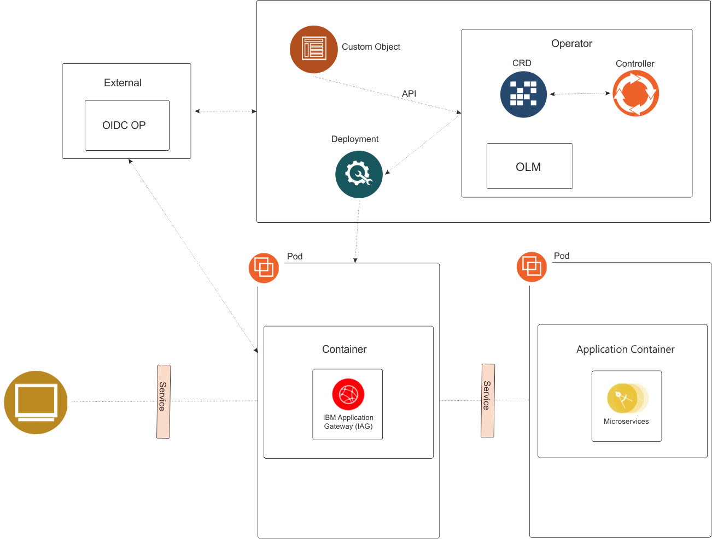
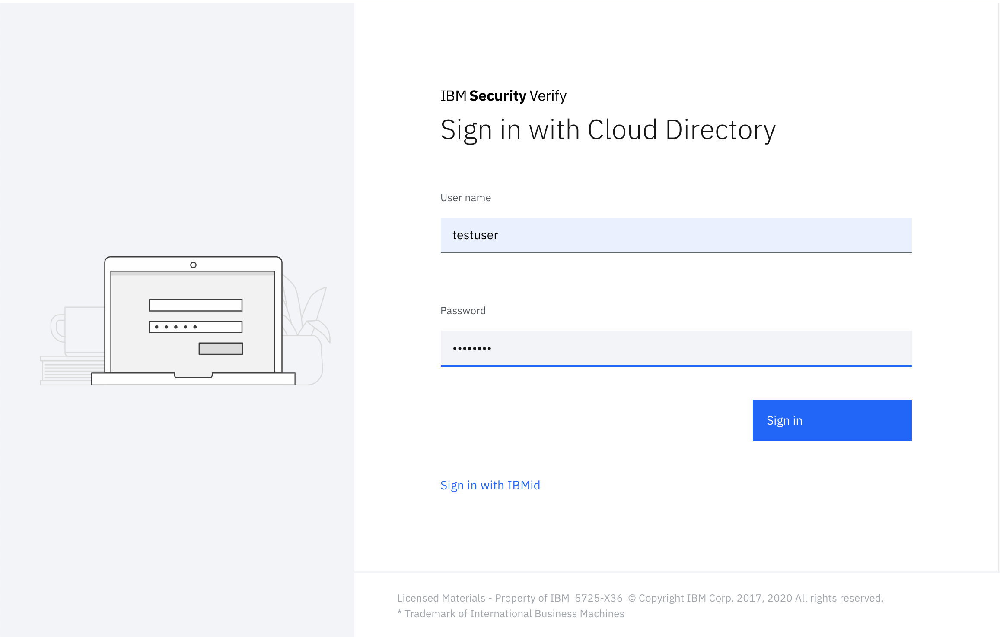
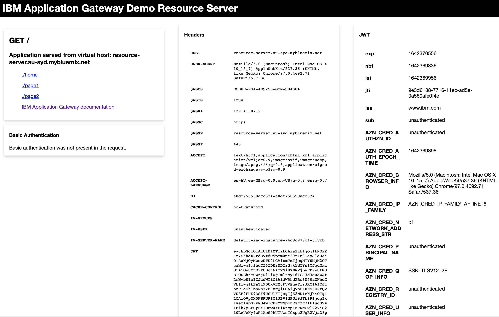

# Introduction

The IBM Application Gateway can be deployed in Kubernetes as an instance of the custom object type 'IBMApplicationGateway'. A special configuration source can be specified that will allow the custom Kubernetes IBM Application Gateway operator to dynamically register a new client with an OIDC OP. The new client ID and secret will be added to the IBM Application Gateway configuration as an OIDC identity.



> Note: It is assumed that the IBM Application Gateway operator has already been installed into the environment and is available.

# Steps

The following steps will:

* Register a new client application with IBM Security Verify
* Create an application that will be fronted by IBM Application Gateway
* Access the application via the IBM Application Gateway
* The page will show the identity and other headers that have been added to the request by the IBM Application Gateway


1. Paste the following into a file named iag\_service\_account.yaml.

```yaml
apiVersion: v1
kind: ServiceAccount
metadata:
  name: ibm-application-gateway
```

2. Create the IBM Application Gateway service account.

```shell
kubectl apply -f iag_service_account.yaml
```

3. Retrieve the IBM Security Verify API Access client ID and secret. For details see the [IBM Security Verify documentation](https://www.ibm.com/support/knowledgecenter/SSCT62/com.ibm.iamservice.doc/tasks/api_clients.html#api_clients)

4. Paste the API Access client ID into a file named tokenRetrievalClientId.

5. Paste the API Access client secret into a file named tokenRetrievalClientSecret.

6. Create a Kubernetes secret containing the API Access client ID and secret.

```shell
kubectl create secret generic oidc-client --from-file=./tokenRetrievalClientSecret --from-file=./tokenRetrievalClientId
``` 

7. Paste the following into a file named co.yaml.

```yaml
apiVersion: ibm.com/v1
kind: IBMApplicationGateway
metadata:
  name: iag-instance
spec:
  replicas: 1
  deployment:
    serviceAccountName: ibm-application-gateway
    image: ibmcom/ibm-application-gateway:21.12.0
    imagePullPolicy: IfNotPresent 
  configuration:
    - type: oidc_registration
      discoveryEndpoint: https://ibm-app-gw.verify.ibm.com/oidc/endpoint/default/.well-known/openid-configuration
      postData: 
        - name: redirect_uris
          values:
            - https://127.0.0.1:30112/pkmsoidc
        - name: client_name
          value: OperatorTest
        - name: enforce_pkce
          value: "false"
        - name: all_users_entitled
          value: "true"
        - name: consent_action
          value: never_prompt
      secret: oidc-client
    - type: literal 
      value: |
        version: "21.12"
        resource_servers:
          - path: "/static"
            connection_type: "ssl"
            servers:
              - host: resource-server.au-syd.mybluemix.net
                port: 443
            identity_headers:
              attributes:
                - attribute: groupIds
                  header: iv_groups
                - attribute: AZN_CRED_AUTHZN_ID
                  header: iv_user
              jwt:
                certificate: "B64:QmFnIEF0dHJpYnV0ZXMKICAgIGZyaWVuZGx5TmFtZTogUlNBCiAgICBsb2NhbEtleUlEOiAwMyA4MiAwMSAwMSAwMCBEMyAwMyBCNSBFMiBERSA3RiBEMSAwOCBFOCBBMCA5QyBENCBDRSBCOCAwQSA1QSBEOSAyRCA2NSAzMCBDNyA3MCA5RiAyRCAxRiA0OSBFRSA3MCA1OCA3QyAyRSA0MCBDOCA3MCBGRSBEOSBFNiAzRSA0RSA2QiBENiAzOCBFMCBEMiAyMyAzOCA3QyBGOSA2RCBDMiAxNCAyRSBERCA2NyBGMSBBRCBDOCAwMyAxNCAyQiBGNCAzNCBEOCA4MCA4MSAwNCBFMiBFMCBBRCA2MSBDMCA4NyA2MSA2RiBCQiA5RSAzMiBDNSBEMCA0MiBERSAxMCBEQSAwNCBDNSAzRSA5OCA2QSA2NCBCQiBCNyA2RSBDQiBDRSBGQyBFRCBDMCBEQiBFMyA3RiAzQSBFRCAxQSBBMyBCNSBBMyBDNyBDRCAxMyAwMSA1NCAwMCBGMSBGRCAwNyBCRCA1NSA3QiBCMyA0NCBFMiA4RiA1OSA0RSAyNSBENiBFMSAyQiBFRSA3MSBFOCBGMCA2NSAxNiAxOCA2OCBEQiBCNCBCNiBBMCBDMiAxNiAwMCBBMiA4MSA1RiBGNyA2NCAwNiA1RiBEQSAyQSBENiA3MiBFRiBCMyBBQyBBMyA0NyAyMiBFOCAxRCA2NiAxMSBDOCBBNSBDOCBBNyAxRCBFNiAxMSA4QiAwOSBBQyAzMyAzNSBGQyAzMyBEOSA5RiA1OCBDNSAzOSBFNyBDMyA3MCAwMiA4NCAxQSA2MSAyMSA5MSBDNCBCOSA2MSBEMiAzOSA3NiBFMSAzRiAzQSBGOCBFNCBGRSBBRSAyQiBCNiA1MyAxMSA0NCBDNiAxRCA2RiA1RCBGMyBGQyAxMyAyNCBFNCA2RCA4QiAwRSA0NCAyNiAzMCAxQSA1QSAyOSA2RSA5RiA4MiBGRCBFRSA2QyA2QSBCQyBBOCBCRiAyQyBCMSA3MiBBQiBENSBDMCBGNyA3NCA3MiA5NCA4RSA3RSA5QyAxOSBFNyAyRiA1MCBEMSAKS2V5IEF0dHJpYnV0ZXM6IDxObyBBdHRyaWJ1dGVzPgotLS0tLUJFR0lOIFBSSVZBVEUgS0VZLS0tLS0KTUlJRXZ3SUJBREFOQmdrcWhraUc5dzBCQVFFRkFBU0NCS2t3Z2dTbEFnRUFBb0lCQVFEbllIR3ZsY0VsWE1jVQprNWVxZ3d2ajJNc2FQblVPWVJYdy9FY2dzRWhKdnRtUVg4ak5lR3Fia1ZnSEJWL3RwZ1lsOW1jSHRPeXRvTzdRCjRLczhBZUFYek5tVCttUTNOR1h5bmx3K1Jod1prZm5vWUhZUExldkZhby82YzY5M1Z6WFFqaXpWa1RITHNjZloKeXJNN2VYdU9rcU9kUlVDTnpFSmNyVVlna3MrTVhsRlo0Zjk0WU9vZGNzYkJzLzZRYXFiWXBVcEEwUXpvRDRRaQpxOXlmUEFoM002WUJ5SnNMeGw5Q3RrVnlSaVFKUG5vZGl1SW1DNTRmZTBIN0NHNlpFOUhCeEc0YTBaZ1VVYWM2CnZoU25zaDJvRVVvQnZkaXVxaWsrYU1uNzFVR3BFTDRZWjQ2STRsQWd4d2xLRlBOZE5zSzBJY0VZbUo4VndCUUQKVnZsQlpKSVRBZ01CQUFFQ2dnRUFaOG4xZFVRQjdoYWVIdmJOOCtqdzduWVROV1NLOGJaUE4xaVROM0NjSEtpRgp3Nk9UMmNlSVd0eHAxa3hzNlpldDdsMkhmZ2VFbTZZek9uTnRuRzlpN0lveGw1V2NXcjhnZENMaFVmWDFLT3M0ClpTclFDcU1ZdmVlOVNpV1dzanZtb2ZVRTI1QlQvQUYxbXBhNHE1Y2srNkYvejA1L1ZKd3BzSlR4Zmk4Yzl1T0YKdGVxMmJDMUJUdFhNSjhJaHZTNi9LWjk0SFZzT2NwcHg2bG5oR1lwS0pQbHU2UHRZYmxCNjFYNkZqWng2MkloRgpQU0Z0UXVoMFlYbWZjYkpKNjlZYm9FQ0hsSEN0ZTE0MGxyanRHeHpEZ3FXa3EybWRyTFF6RHNhOWkxVjNvRE52Ckg0K3NrMGNwN1NVeGpWbXA1TzZENjdkTmZJaWk2MklnRUZNb0NRZUdjUUtCZ1FEN3RvM0pQbWF4SElKUWVOZXEKUkl0b3FpalUxcFJHVXZONUE4cEthckhkTHhPNnJxV25ZT0NHNzJzV0crSXRDeGg0dVJtYlBxcy9heXpDRVE2bgpkK05OWG9tbFV2Wng1dU90VGl5dkhVOUZ3ZE16clJ6T0hIc0lkUktHY2QxY0RWQm00dCtyRnlGRDl1YXNlN1dCCkxPbEFkRC95YkRWZjFUY1d4em5kbGFJNnJRS0JnUURyVVRtOGYwdm9yZm4vV29Ta3NmOEJ4M2JSYjB1Wk85Z1EKVGIveC84WXJvdStvKzZjcHRuMHk0N3MvckRNWFUyUUxNKzdHT3ZuNEd6eHVYVXBVdEZhY1pyOFB1Y09lM3ZqNQpsY21ablZHUHBSaVlvUWYvQVFFUWZtNk9ldUNOQ0dKUkZsM0szS09uN2xJaTI1MnVONHRZbXdLWGFkSjBOdVVYCk1za1NjRkpYdndLQmdRQ2Exazhkcmc4SmY5b0JtblEvdnU1cXNkRndLNWNHTTF5bDRsajdzZW83Znd3SjJBajYKanpOT2pkUTN3MnM3L2dsTnFiOUFxaW81VnJvdm5zSis3ZGFhN3o2SXZpSHZLdkorMXduUnBwdnU4eTN5S2RrQQpTTEMrSVJZR01lRFRFVFdXTkpVVjc2Sjg1bEk3WTlYZzRqbVJkbkVudEx5WWVOWHNZeDBMVzFKeCtRS0JnUUN2CndMYlNwbkRYbERsSUV4OUdzdnEzSlhjRTdZOFZIN0U4WEJXa2RWaFpkeFJ3cmFRb2IzZ0s3alFJVm1EQ1p6SXQKZTlnMmpnM3MxTXJKMHp1VkVDd3dIRDFQVFh0aHlUOURpakJNWDBkdmRldHM4N2k1S05MV3N0ZDM2eWFUcjFOZgpKTWxnbm5KTkZwNmFFbFV1cmFXUnhCU25hZzRaWm5hc1lPMzBxNWVVbVFLQmdRQzNKdDdxVHpSSVB0VEhQZGdlCmxzUThGZDBaeHdkNDNncENVYnpndys1QjlvSWVmMFV2NE1YZzMzZDZOaGV6MFdrTHBaMmFZZy8yVnBjV09NTjQKMC9KRW9ta2xjeFlFSkxaY0MyeDhWOVkxemgrOTBFTkpKVnZGS0FadXdhM2Ftc1VicU0ySnFvQ0thR29pbUdEdgptc1kvS1Q0NE8ycm9wazBBWEJ4VWlUZ3Ewdz09Ci0tLS0tRU5EIFBSSVZBVEUgS0VZLS0tLS0KQmFnIEF0dHJpYnV0ZXMKICAgIGZyaWVuZGx5TmFtZTogUlNBCiAgICBsb2NhbEtleUlEOiAwMyA4MiAwMSAwMSAwMCBEMyAwMyBCNSBFMiBERSA3RiBEMSAwOCBFOCBBMCA5QyBENCBDRSBCOCAwQSA1QSBEOSAyRCA2NSAzMCBDNyA3MCA5RiAyRCAxRiA0OSBFRSA3MCA1OCA3QyAyRSA0MCBDOCA3MCBGRSBEOSBFNiAzRSA0RSA2QiBENiAzOCBFMCBEMiAyMyAzOCA3QyBGOSA2RCBDMiAxNCAyRSBERCA2NyBGMSBBRCBDOCAwMyAxNCAyQiBGNCAzNCBEOCA4MCA4MSAwNCBFMiBFMCBBRCA2MSBDMCA4NyA2MSA2RiBCQiA5RSAzMiBDNSBEMCA0MiBERSAxMCBEQSAwNCBDNSAzRSA5OCA2QSA2NCBCQiBCNyA2RSBDQiBDRSBGQyBFRCBDMCBEQiBFMyA3RiAzQSBFRCAxQSBBMyBCNSBBMyBDNyBDRCAxMyAwMSA1NCAwMCBGMSBGRCAwNyBCRCA1NSA3QiBCMyA0NCBFMiA4RiA1OSA0RSAyNSBENiBFMSAyQiBFRSA3MSBFOCBGMCA2NSAxNiAxOCA2OCBEQiBCNCBCNiBBMCBDMiAxNiAwMCBBMiA4MSA1RiBGNyA2NCAwNiA1RiBEQSAyQSBENiA3MiBFRiBCMyBBQyBBMyA0NyAyMiBFOCAxRCA2NiAxMSBDOCBBNSBDOCBBNyAxRCBFNiAxMSA4QiAwOSBBQyAzMyAzNSBGQyAzMyBEOSA5RiA1OCBDNSAzOSBFNyBDMyA3MCAwMiA4NCAxQSA2MSAyMSA5MSBDNCBCOSA2MSBEMiAzOSA3NiBFMSAzRiAzQSBGOCBFNCBGRSBBRSAyQiBCNiA1MyAxMSA0NCBDNiAxRCA2RiA1RCBGMyBGQyAxMyAyNCBFNCA2RCA4QiAwRSA0NCAyNiAzMCAxQSA1QSAyOSA2RSA5RiA4MiBGRCBFRSA2QyA2QSBCQyBBOCBCRiAyQyBCMSA3MiBBQiBENSBDMCBGNyA3NCA3MiA5NCA4RSA3RSA5QyAxOSBFNyAyRiA1MCBEMSAKc3ViamVjdD1DTiA9IHJzYS5hdXRvdGVzdC5pYm0uY29tCgppc3N1ZXI9Q04gPSByc2EuYXV0b3Rlc3QuaWJtLmNvbQoKLS0tLS1CRUdJTiBDRVJUSUZJQ0FURS0tLS0tCk1JSURBakNDQWVxZ0F3SUJBZ0lJV3ZmTmxuV0c1MWt3RFFZSktvWklodmNOQVFFTkJRQXdIekVkTUJzR0ExVUUKQXhNVWNuTmhMbUYxZEc5MFpYTjBMbWxpYlM1amIyMHdIaGNOTVRreE1qRTVNREV6TWpBeldoY05Namt4TWpFMwpNREV6TWpBeldqQWZNUjB3R3dZRFZRUURFeFJ5YzJFdVlYVjBiM1JsYzNRdWFXSnRMbU52YlRDQ0FTSXdEUVlKCktvWklodmNOQVFFQkJRQURnZ0VQQURDQ0FRb0NnZ0VCQU9kZ2NhK1Z3U1ZjeHhTVGw2cURDK1BZeXhvK2RRNWgKRmZEOFJ5Q3dTRW0rMlpCZnlNMTRhcHVSV0FjRlgrMm1CaVgyWndlMDdLMmc3dERncXp3QjRCZk0yWlA2WkRjMApaZktlWEQ1R0hCbVIrZWhnZGc4dDY4VnFqL3B6cjNkWE5kQ09MTldSTWN1eHg5bktzenQ1ZTQ2U281MUZRSTNNClFseXRSaUNTejR4ZVVWbmgvM2hnNmgxeXhzR3ovcEJxcHRpbFNrRFJET2dQaENLcjNKODhDSGN6cGdISW13dkcKWDBLMlJYSkdKQWsrZWgySzRpWUxuaDk3UWZzSWJwa1QwY0hFYmhyUm1CUlJwenErRktleUhhZ1JTZ0c5Mks2cQpLVDVveWZ2VlFha1F2aGhuam9qaVVDREhDVW9VODEwMndyUWh3UmlZbnhYQUZBTlcrVUZra2hNQ0F3RUFBYU5DCk1FQXdIUVlEVlIwT0JCWUVGQmN6SEZZYWdUd0VuNGVNOVlacTZ6TS9QeFdFTUI4R0ExVWRJd1FZTUJhQUZCY3oKSEZZYWdUd0VuNGVNOVlacTZ6TS9QeFdFTUEwR0NTcUdTSWIzRFFFQkRRVUFBNElCQVFEVEE3WGkzbi9SQ09pZwpuTlRPdUFwYTJTMWxNTWR3bnkwZlNlNXdXSHd1UU1ody90bm1QazVyMWpqZzBpTTRmUGx0d2hRdTNXZnhyY2dECkZDdjBOTmlBZ1FUaTRLMWh3SWRoYjd1ZU1zWFFRdDRRMmdURlBwaHFaTHUzYnN2Ty9PM0EyK04vT3UwYW83V2oKeDgwVEFWUUE4ZjBIdlZWN3MwVGlqMWxPSmRiaEsrNXg2UEJsRmhobzI3UzJvTUlXQUtLQlgvZGtCbC9hS3RaeQo3N09zbzBjaTZCMW1FY2lseUtjZDVoR0xDYXd6TmZ3ejJaOVl4VG5udzNBQ2hCcGhJWkhFdVdIU09YYmhQenI0CjVQNnVLN1pURVVUR0hXOWQ4L3dUSk9SdGl3NUVKakFhV2lsdW40TDk3bXhxdktpL0xMRnlxOVhBOTNSeWxJNSsKbkJubkwxRFIKLS0tLS1FTkQgQ0VSVElGSUNBVEUtLS0tLQo="
                hdr_name: jwt
                claims:
                  - text: www.ibm.com
                    name: iss
                  - attr: AZN_CRED_PRINCIPAL_NAME
                    name: sub
                  - attr: AZN_*
```

8. Deploy the custom object.

> This will dynamically register a new client/application named OperatorTest with IBM Security Verify.

```shell
kubectl apply -f co.yaml
```

9. Ensure that the IBM Application Gateway pod has started correctly.

```shell
kubectl get all

NAME                                                    READY   STATUS    RESTARTS   AGE
pod/iag-instance-76759f9764-nh4jd                       1/1     Running   0          3s
pod/ibm-application-gateway-operator-6bb9c7d4fc-lq4v2   1/1     Running   0          10m

NAME                                               TYPE           CLUSTER-IP       EXTERNAL-IP   PORT(S)             AGE
service/ibm-application-gateway-operator-metrics   ClusterIP      10.110.202.103   <none>        8383/TCP,8686/TCP   10m
service/kubernetes                                 ClusterIP      10.96.0.1        <none>        443/TCP             11m

NAME                                               READY   UP-TO-DATE   AVAILABLE   AGE
deployment.apps/iag-instance                       1/1     1            1           3s
deployment.apps/ibm-application-gateway-operator   1/1     1            1           10m

NAME                                                          DESIRED   CURRENT   READY   AGE
replicaset.apps/iag-instance-76759f9764                       1         1         1       3s
replicaset.apps/ibm-application-gateway-operator-6bb9c7d4fc   1         1         1       10m
```

10. Expose the IBM Application Gateway port.

```shell
kubectl port-forward deployment.apps/iag-instance 30112:8443
```

11. Use a browser to access the demo URL. 

```
https://127.0.0.1:30112/static
```

12. Sign in using the IBM Security Verify sign in page.



13. The demo page is shown. 



> This page includes the following pieces that have been added by the IBM Application Gateway: <br/>
>    - A JWT header has been added <br/>
>    - The AZN-CRED-REGISTRY-ID header has been added <br/>
>    - The MECH-INFO header has been added <br/>
>    - The JWT has been extracted.

14. Exit the port forward process by pressing ctrl-c in the shell.

15. Cleanup.

```shell
kubectl delete -f co.yaml
```
